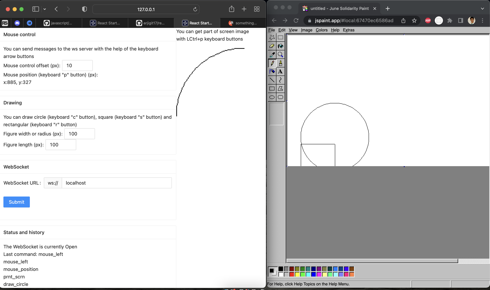

# remote_control

##Instruction:

1. `git clone https://github.com/erjigit17/remote_control`
2. `git checkout dev`
3. rename `.env.example` to `.env`
4. `npm i` or `npm ci`
5. `npm start` or `npm run start:dev`
6. open in browser `127.0.0.1:3000`
7. open paint or in browser `https://jspaint.app/`

_Any questions @erjigit17_
   